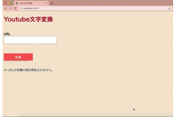
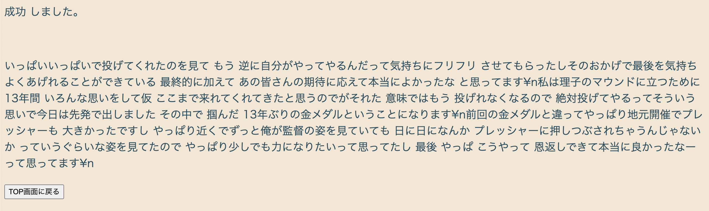

YouTube動画の文字起こしApp
====

<br />

# はじめに
- 個人利用の範囲を超える場合において、YouTubeの規約に違反する可能性があります。使用ライブラリ、及びYouTubeのポリシーをご確認ください。
- 個人利用の範囲内であったとしても、良識の範囲内での使用が求められます。サーバー負荷なども考慮してご使用ください。

<br />

# Usage

- docker環境を想定しています。

<br />

1. このリポジトリをローカルにクローン
```
$ git clone
```

<br />

2. Dockerコンテナをビルド&起動
```
$ docker-compose up -d
```

<br />

3. `http://localhost:5000`にアクセス

<br />

4. 検索対象のURLを入力し、変換ボタンを押下



<br />

5. 検索結果が画面表示される。また`app/log`に簡易ログ、`app/movies`にダウンロードされた動画ファイル、`app/text`にテキストファイルがそれぞれ出力される。



<br />

6. 正しくないURLが入力された場合、変換できない。


<br />

7. その他
  - 600秒を経過するとタイムアウトエラーを発生させている。
  - 正しくテキスト変換できない場合もエラーになる。
  - URLが空欄のままボタンを押下しても処理が始まらない。
  - 処理中はボタンの押下ができなくなる。（ボタン連打を防ぐため）
